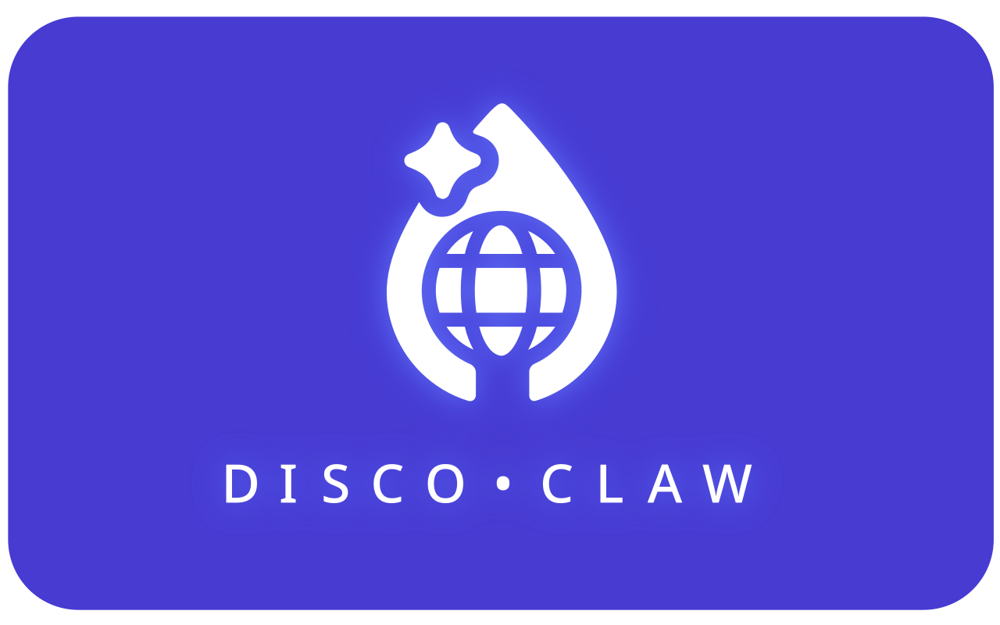

<p align="center">
  
</p>

# DiscoClaw

A personal AI orchestrator that turns Discord into a persistent workspace — built on three pillars: **Memory**, **Beads**, and **Crons**.

DiscoClaw is an orchestrator: it coordinates between a user interface (Discord), one or more AI runtimes (Claude Code, OpenAI, Codex), and local system resources — managing conversation state, task routing, scheduling, and tool access. The intelligence is rented; the coordination is owned.

It turns a private Discord server into a persistent AI workspace. Your assistant remembers you across sessions, tracks work in forum threads, and runs scheduled tasks autonomously — all through natural conversation.

It's designed for a single user on a fresh, private server — your own sandbox. Not a shared bot, not a multi-user platform. Just you and your assistant in a space you control.

No gateways, no proxies, no web UI to deploy — Discord *is* the interface. Run DiscoClaw on a Linux or macOS machine (see [Platform support](#platform-support)) and talk to your assistant from anywhere Discord works: desktop, mobile, browser.

The codebase is intentionally small — small enough to read, audit, and modify directly. Customization means changing the code, not configuring a plugin system.

## Why Discord?

Discord gives you channels, forum threads, DMs, mobile access, and rich formatting for free. DiscoClaw maps its three core features onto Discord primitives so there's nothing extra to learn — channels become context boundaries, forum threads become task cards and job definitions, and conversation history is the raw material for memory.

## Memory — the bot knows you

Your assistant carries context across every conversation, channel, and restart.

- **Durable facts** — `!memory remember prefers dark mode` persists across sessions and channels
- **Rolling summaries** — Compresses earlier conversation so context carries forward, even across restarts
- **Per-channel context** — Each channel gets a markdown file shaping behavior (formal in #work, casual in #random)
- **Customizable identity** — Personality, name, and values defined in workspace files (`SOUL.md`, `IDENTITY.md`, etc.)
- **Group chat aware** — Knows when to speak up and when to stay quiet in shared channels

**Why Discord fits:** channels = context boundaries, DMs = private deep context, conversation history is the raw material.

## Beads — the bot tracks your work

A lightweight issue tracker ([beads](https://github.com/qwibitai/beads)) that syncs bidirectionally with Discord forum threads.

- **Create from either side** — `bd add "fix login bug"` in the terminal or ask your assistant in chat
- **Bidirectional sync** — Status, priority, and tags stay in sync between the CLI and Discord threads
- **Status emoji and auto-tagging** — Thread names show live status at a glance
- **Discord actions** — Your assistant manages tasks through conversation: create channels, send messages, search history, run polls, and more

**Why Discord fits:** forum threads = task cards, archive = done, thread names show live status.

## Crons — the bot acts on its own

Recurring tasks defined as forum threads in plain language — no crontab, no separate scheduler UI.

- **Plain-language schedules** — "every weekday at 7am, check the weather and post to #general"
- **Edit to change, archive to pause, unarchive to resume**
- **Full workspace access** — File I/O, web search, browser automation, Discord actions
- **Multi-turn sessions** — A live process persists between runs, so context carries across executions

**Why Discord fits:** forum threads = job definitions, archive/unarchive = pause/resume, no separate scheduler UI needed.

## How it works

DiscoClaw orchestrates the flow between Discord and AI runtimes (Claude Code by default, with OpenAI and Codex adapters available via `PRIMARY_RUNTIME`). It doesn't contain intelligence itself — it decides *when* to call the AI, *what context* to give it, and *what to do* with the output. When you send a message, the orchestrator:

1. Checks the user allowlist (fail-closed — empty list means respond to nobody)
2. Assembles context: per-channel rules, conversation history, rolling summary, and durable memory
3. Routes to the appropriate runtime adapter, running in your workspace directory
4. Streams the response back, chunked to fit Discord's message limits
5. Parses and executes any Discord actions the assistant emitted

## Customization

### Shareable integration recipes

DiscoClaw supports a shareable markdown recipe format for passing integrations between users:

- Spec: `docs/discoclaw-recipe-spec.md`
- Template: `templates/recipes/integration.discoclaw-recipe.md`
- Example files: `recipes/examples/*.discoclaw-recipe.md`
- Skills:
  - `skills/discoclaw-recipe-generator/SKILL.md`
  - `skills/discoclaw-recipe-consumer/SKILL.md`
- Install/refresh invocable skill symlinks:
  - `pnpm claude:install-skills`

Author one recipe file for an integration, share it, then let another user's DiscoClaw agent consume it and produce a local implementation checklist before coding.

## Prerequisites

- **Node.js >=20** — check with `node --version`
- **pnpm** — enable via Corepack (`corepack enable`) or install separately
- One primary runtime:
  - **Claude CLI** on your `PATH` — check with `claude --version` (see [Claude CLI docs](https://docs.anthropic.com/en/docs/claude-code) to install), or
  - **Codex CLI** on your `PATH` — check with `codex --version`, or
  - **OpenAI-compatible API key** via `OPENAI_API_KEY`
- Runtime-specific access for your chosen provider (Anthropic plan/API credits for Claude, OpenAI access for Codex/OpenAI models)

## Quick start

### Discord setup (private server + bot)

1. Create a **private Discord server** dedicated to DiscoClaw (not a shared/public server).
2. In the [Discord Developer Portal](https://discord.com/developers/applications), create an application, then go to **Bot** -> **Add Bot**.
3. Under **Bot** -> **Privileged Gateway Intents**, enable **Message Content Intent**.
4. Copy the bot token and set it in `.env` as `DISCORD_TOKEN=...`.
5. Invite the bot to your server:
   - Go to **OAuth2** -> **URL Generator**
   - Under **Scopes**, tick `bot`
   - A **Bot Permissions** grid appears below. For a private server, tick `Administrator` (top-left, under General Permissions) — it's one checkbox and covers everything. For tighter permissions, see the [permission profiles](docs/discord-bot-setup.md#permission-profiles-choose-intentionally) in the full guide.
   - Copy the generated URL at the bottom, open it, pick your server, and authorize
6. In Discord, enable **Developer Mode** (User Settings -> Advanced), then copy IDs and set:
   - `DISCORD_ALLOW_USER_IDS=<your user id>` (required; fail-closed if empty)
   - `DISCORD_GUILD_ID=<server id>` (recommended; required for auto-creating forum channels)

Full step-by-step guide: [docs/discord-bot-setup.md](docs/discord-bot-setup.md)

### Install and run

1. **Install and configure:**
   ```bash
   pnpm install
   pnpm setup            # guided interactive setup
   # Or manually: cp .env.example .env and fill in required vars:
   #   DISCORD_TOKEN
   #   DISCORD_ALLOW_USER_IDS
   # For all ~90 options: cp .env.example.full .env
   ```

2. **Run:**
   ```bash
   pnpm dev
   ```

## Updating

After pulling new changes:

```bash
git pull
pnpm install
pnpm build
```

Run `pnpm preflight` — it flags configuration options from `.env.example` that aren't in your `.env` yet.

If running as a systemd service, restart it:

```bash
systemctl --user restart discoclaw.service
```

## Platform support

- **All platforms** — `pnpm dev` works everywhere Node.js runs (Linux, macOS, Windows)
- **Linux** — systemd service file provided for production deployment (see `.context/ops.md`)
- **macOS / Windows** — use pm2, screen, or another process manager for long-running deployment; or just `pnpm dev` in a terminal

> Windows is not tested for production use in v0.x. The session scanner has known path-handling issues on Windows, and the Claude CLI primarily targets Linux and macOS.

## Safety

DiscoClaw orchestrates powerful local tooling via AI runtimes, often with elevated permissions. Treat it like a local automation system connected to Discord.

- Use a **private Discord server** — don't start in a shared or public server
- Use **least-privilege** Discord permissions
- Keep `DISCORD_ALLOW_USER_IDS` tight — this is the primary security boundary
- Empty allowlist = respond to nobody (fail-closed)
- Optionally restrict channels with `DISCORD_CHANNEL_IDS`
- External content (Discord messages, web pages, files) is **data**, not instructions

## Workspace layout

The orchestrator runs AI runtimes in a separate working directory (`WORKSPACE_CWD`), keeping the repo clean while giving your assistant a persistent workspace.

- Set `DISCOCLAW_DATA_DIR` to use `$DISCOCLAW_DATA_DIR/workspace` (good for Dropbox-backed setups)
- Or leave it unset to use `./workspace` relative to the repo
- Content (channel context, Discord config) defaults to `$DISCOCLAW_DATA_DIR/content`

## Development

```bash
pnpm preflight  # preflight check (Node, pnpm, Claude CLI, .env)
pnpm dev        # start dev mode
pnpm build      # compile TypeScript
pnpm test       # run tests
```

## Built with

[Claude Code](https://claude.ai/claude-code), [OpenAI Codex](https://openai.com/index/openai-codex/), [discord.js](https://discord.js.org), [Croner](https://github.com/hexagon/croner), and [Beads](https://github.com/qwibitai/beads).

## License

[MIT](LICENSE). See [DISCLAIMER.md](DISCLAIMER.md) for important usage terms.
