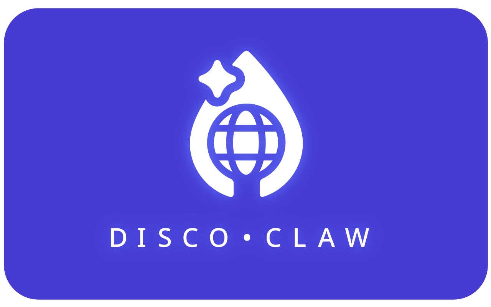

<p align="center">
  
</p>

# DiscoClaw

A personal AI orchestrator that turns Discord into a persistent workspace — built on three pillars: **Memory**, **Tasks**, and **Automations**.

[](https://www.npmjs.com/package/discoclaw)
[](LICENSE)
[](package.json)

> Turn Discord into a persistent AI workspace — memory, tasks, automations, and voice, all through natural conversation.

DiscoClaw coordinates between Discord, AI runtimes (Claude Code, OpenAI, Codex, Gemini, OpenRouter), and local system resources. The intelligence is rented; the coordination is owned. Designed for a single user on a private server — your own sandbox.

No gateways, no proxies, no web UI. Discord *is* the interface.

## Memory — the bot knows you

- **Durable facts** — persist across sessions, channels, and restarts
- **Rolling summaries** — context carries forward, even across restarts
- **Semantic search** — vector + keyword search over past conversations, auto-retrieved
- **Per-channel personality** — markdown files shape behavior per channel
- **YouTube transcripts** — share a link, the bot reads the video

## Tasks — the bot tracks your work

- **Bidirectional sync** — task store and Discord forum threads stay in sync
- **Create from anywhere** — chat, commands, or the forum directly
- **Live status** — thread names show status emoji at a glance
- **Discord actions** — the bot manages channels, messages, polls, and more through conversation

## Automations — the bot acts on its own

- **Plain-language schedules** — "every weekday at 7am, check the weather"
- **Forum-thread definitions** — edit to change, archive to pause
- **Full workspace access** — files, web, browser automation, Discord actions

## Voice — the bot talks back

Real-time voice with STT (Deepgram), TTS (Cartesia), barge-in, and transcript mirroring. Off by default. [Setup guide →](docs/voice.md)

## Self-management

Self-update from Discord (`!update apply`), health checks (`!doctor`), secret management (`!secret`), runtime model switching (`!models`), and restart (`!restart`) — no SSH needed.

## Quick start

```bash
npm install -g discoclaw
discoclaw init
discoclaw install-daemon
```

You'll need a [private Discord server and bot token](docs/discord-bot-setup.md) and at least one AI runtime ([configuration reference](docs/configuration.md)).

**From source:**

```bash
git clone https://github.com/DiscoClaw/discoclaw.git && cd discoclaw
pnpm install --frozen-lockfile
pnpm run setup
pnpm build && pnpm dev
```

See [CONTRIBUTING.md](CONTRIBUTING.md) for the full contributor setup including runtime validation.

## Documentation

**Getting started:** [Discord bot setup](docs/discord-bot-setup.md) · [Configuration](docs/configuration.md) · [MCP](docs/mcp.md)

**Features:** [Memory](docs/memory.md) · [Tasks](docs/tasks.md) · [Crons](docs/cron.md) · [Voice](docs/voice.md) · [Discord actions](docs/discord-actions.md) · [Plan & Forge](docs/plan-and-forge.md) · [Browser automation](docs/browser.md) · [Recipes](docs/discoclaw-recipe-spec.md)

**Operations:** [Runtime switching](docs/runtime-switching.md) · [Dashboard](docs/dashboard-tailscale.md) · [Webhook exposure](docs/webhook-exposure.md) · [Data migration](docs/data-migration.md)

**Audits:** [Provider/auth matrix](docs/audit/provider-auth-1.0-matrix.md) · [Claude](docs/audit/claude-blank-machine-readiness.md) · [Codex](docs/audit/codex-blank-machine-readiness.md)

**Development:** [Philosophy](docs/philosophy.md) · [Releasing](docs/releasing.md) · [Inventory](docs/INVENTORY.md)

## Platform support

Linux (systemd service included), macOS, Windows. Production daemon via systemd on Linux, or pm2/screen elsewhere.

## Safety

Use a **private Discord server**, keep `DISCORD_ALLOW_USER_IDS` tight (fail-closed if empty), and use least-privilege Discord permissions. See [SECURITY.md](SECURITY.md).

## Built with

[Claude Code](https://claude.ai/claude-code), [OpenAI Codex](https://openai.com/index/openai-codex/), [discord.js](https://discord.js.org), and [Croner](https://github.com/hexagon/croner).

## License

[MIT](LICENSE). See [DISCLAIMER.md](DISCLAIMER.md) for important usage terms.
